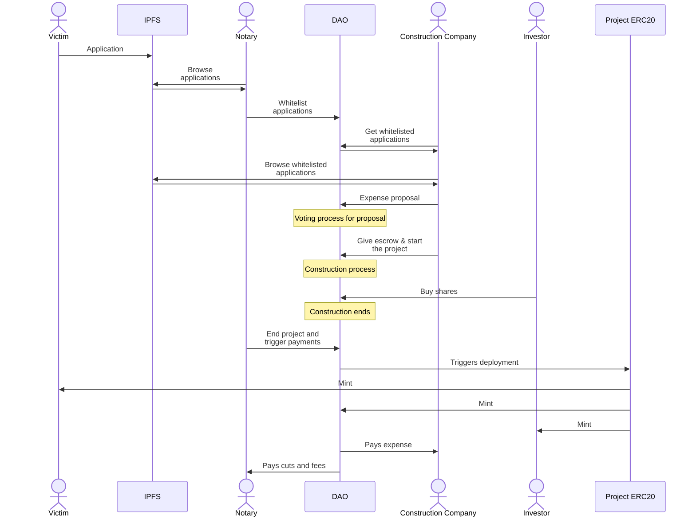
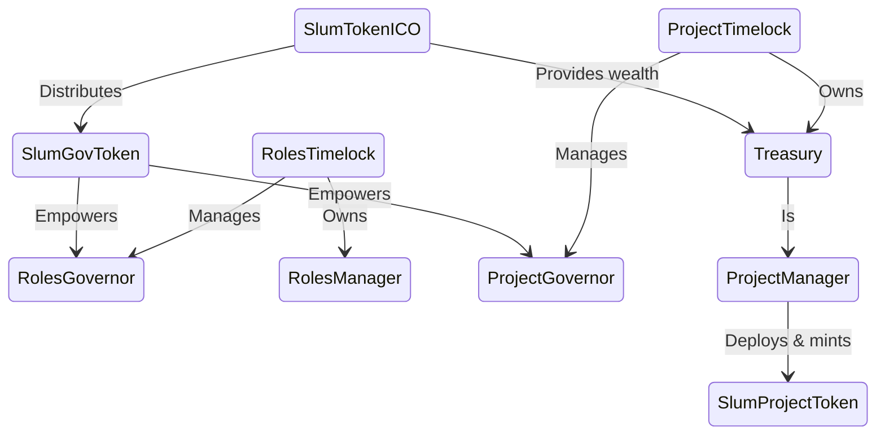

# Introduction

SlumDAO aims to create a democratic and transparent environment to reconstruct weak buildings in earthquake danger zones. It tries to incentivize different parties to work together and facilitate an economically sustainable management system.

SlumDAO extends OpenZeppelin's Governance contracts to implement its own protocol, alongside mechanisms like **initial coin offering**, **donations**, **role and permissions management**, etc.

<br>

Run end-to-end simulation:

```bash
$ npm i && npx hardhat test
```

To gain deeper insight, [read the tests](./test/Business.test.js)

<br>
<br>

<details>
<summary>Actors</summary>

   <br>
   
   SlumDAO brings **DAO members**, **notaries**, and **construction companies** together and tries to implement a protocol for making it profitable for all parties to join the cause.

1.  **DAO Members**: Anyone holding some amount of [SGT](./contracts/SlumGovToken.sol) has voting power. Token holders can **delegate** their voting power either to themselves or to anyone that they trust. Using these tokens, DAO members are expected to vote **for**, **neutral**, or **against** given **proposals**. Through this governance protocol they take the main decisions on starting / funding a project, or cancelling a project.

    DAO members also nominate and select other roles. An EOA can only become a notary or a construction company by going through the governance process.

2.  **Notaries**: Notaries are trusted representatives elected by DAO members. They are mainly expected to browse a set of public records of 'applications' from people residing in poor constructions. This role is absolutely necessary to resolve some inevitable oracle problems like proving an applicant actually resides in an earthquake danger zone, or is actually helpless to move to another building, and so on. Notaries are paid as generous fees, and can be cancelled by the community through a governance process.

3.  **Construction Companies**: These are the main 'service providers' of the system. Companies' main responsibility is to make **proposals** on **candidate projects** registered by notaries. They create a record with all the pre-determined information required in the proposal and publish it to an immutable and public data source like IPFS.

    The crowd is then expected to evaluate the proposal, and come into an aggreement on if the project should start or not. This is where the main voting process happen. Should a project start, construction companies publish regular reports in a pre-defined format to inform the crowd about the process.

</details>

<br>


<details>

<summary>Business Flow</summary>

<br>

Entry point to the system is an application made by people residing in weak buildings located in an earthquake danger zone. These people are expected to send their applications to a public application pool. This process may require involving information from the person's national identity record, like their citizenship number, or any other data with a formally representative value.

Notaries evaluate these applications and they have the authority to whitelist an application. An application is called a **candidate project** once it's whitelisted. Without being whitelisted by a notary, an application is not a part of the system. Notaries are encouraged to play active role in this registration process because if a project gets successfully built, the notary that registered that project in the beginning gets the remarkable **project registration cut**. This cut is entirely paid by the construction companies, and is paid when the project eventually finishes successfully.

 Construction companies browse hundreds of candidate projects and pick the ones they see fit to their business plan. Then, they create a detailed report for each project they want to carry, and make an **expense proposal** to the DAO with all these details. The DAO members can browse through all the expense proposals, and vote for them as defined by OpenZeppelin's governance protocol.

 Proposals that fail to pass the voting process do not cause a trigger to any significant event. They just lose the game, but the companies are welcome to create new proposals with better offers, because SlumDAO changes this game into a transparent negotiation.

 Proposals that pass the voting process semantically means that the DAO chose to trust the company on reconstruction of the given building. Companies are expected to make a final function call to the DAO and actually start the building process. One important thing about starting the construction process is that companies must <u>stake 20% of all the costs of the construction</u> as an escrow to the DAO treasury. This will play as the ultimate leverage given to the DAO discouraging companies to play the malicious actor.

 Successfull projects each result in deployment of an ERC20 token for each flat built within the project. These tokens represent the shares of the new flats. The new building's share is aggressively given to the DAO treasury, but a minimum of 25% of at least one single flat is guaranteed to be given to the earthquake victim, covering [Shared Ownership on Homes](https://www.gov.uk/shared-ownership-scheme) to provide residency for the victim.

 During the process of construction, DAO can vote and **cancel** the project. This is made possible by SlumDAO, and powered by an immutable and public data source like IPFS, as the companies give promise to real people on a schedule of work. We leverage this real life negotiation as the trust base of the system: we off-load trust to a crowd, and force companies to stay accountable towards the crowd.

 If a project is not cancelled and the promised construction time elapses, then again any **notary** is expected to review the community satisfaction, verify the success of the project in real life, and mark the project as done in the blockchain. Notaries get rewarded for this responsibility with **project ending cut**, again paid by construction companies.


<br>




</details>


<br>

<details>
<summary>Sources of Income</summary>

<br>

SlumDAO relies on investments, donations, and it implements an ICO selling governance tokens to public. A considerable share of governance tokens are sold in the ICO. Money raised in the ICO is transferred to the DAO treasury to help fuel upcoming projects.

EOAs can buy shares from a new project by paying unpaid expenses (if any) of a project. If an external investor pays 100% of all these expenses, they get to own a configurable (60% by default) portion of the new project. A project can be considered by many investors, or a single investor. If no investors decide to support a project, then the DAO collects all shares of the new project apart from the victim's share, because the DAO will be paying all the construction expenses.

</details>

<br>

<details>
    <summary>Contracts</summary>

<br>

### **SlumTokenICO**

Organizes the initial coin offering process in an effort to collect early stage funds for the DAO. ICO process ends with transferring the collected funds to the DAO treasury, as well as distributing the Slum governance token mints.

Contract destroys itself after this process.

### **SlumGovToken**

The governance token empowering all voting processes SlumDAO defines. Distribution of the governance token is handled by the ICO process, as well as yielding a small proportion to the admin account for emergency situations, and room for flexibility.

### **RolesTimelock**

A purely OpenZeppelin defined Timelock contract owning the **RolesManager** contract.

### **RolesGovernor**

A purely OpenZeppelin defined Governor contract. This contract manages the voting processes regarding role distributions. Votes shall be sent to this contract.

### **RolesManager**

This contract defines the database for different roles and implements functions for addition and removal.

These roles are then respected across any other contract deployed within SlumDAO infrastructure.

### **ProjectTimelock**

An extended version of OpenZeppelin' Timelock. This contract is the one that owns the DAO **Treasury** contract. Implements additional functionality for notaries to mark projects as 'ended' and trigger the ending logic.

### **ProjectGovernor**

An extension to OpenZeppelin's Governor contract. This contract is the one accepting the votes on project-related processes, including which project should be accepted, which should be cancelled, and so on.

The main extension to this contract is the proposal logic. Because OpenZeppelin's governance works through making a call to another contract, here we implement some checks on the arguments of a proposal to make sure the execution process runs flawlessly. This logic can be seen in the propose() function of the [contract](./contracts/project_gov/ProjectGovernor.sol).

### **Treasury**

DAO's piggy bank. This is the main place we accept donations, manage the projects, and do the math for payments. Treasury contract is entirely owned by **ProjectTimelock**, meaning that the changes must go through the defined Governance process.

This contract also inherits **ProjectManager**, hence maintains the ultimate database and logic on projects' lifecycles.

### **ProjectManager**

This contract hosts all project-related logic and dataset. Because it needs to deal with payments, **Treasury** contract has direct access to this contract by inheriting it.

Information about a project that got started can be retrieved from this contract. This means it serves information like the ipfs hash of the project, the victim address, the notary that registered the project, the company that builds it, the ERC20 token address, etc.

### **SlumProjectToken**

This contract represents ownership shares for a completed project. It is deployed by **ProjectManager**. This is the ultimate place to implement an ownership sharing logic among participants of the project.

</details>

<br>
<br>
<br>



<br>
